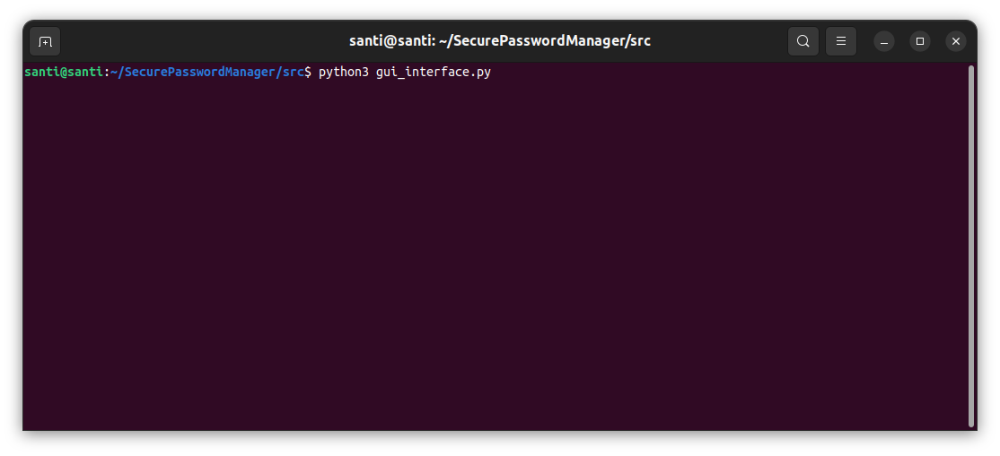
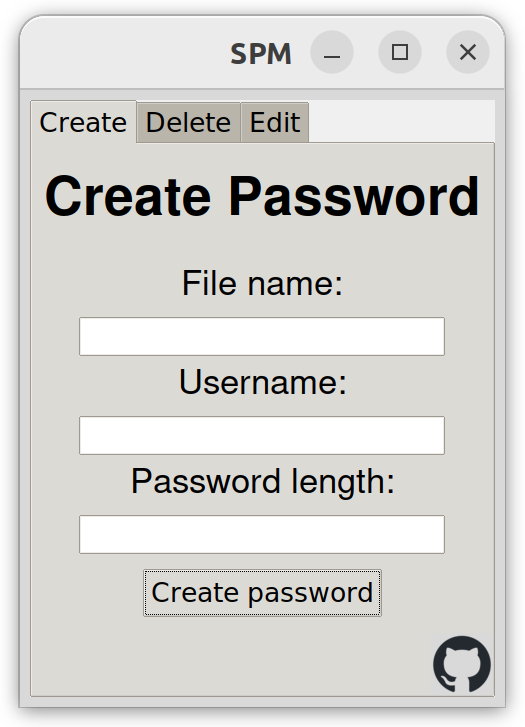
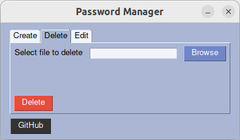
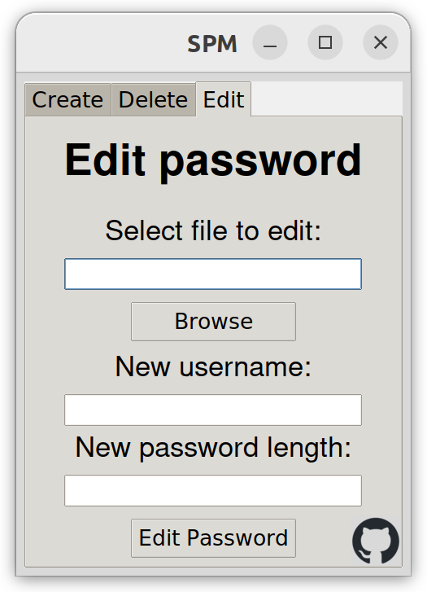

# PasswordGenerator
 With this program you will be able to create random passwords with the length you desire. The passwords will be saved in the same directory where the python file is located.
 You can also edit the password generating another one or even delete a file you don't need anymore.

 ## Usage
First of all you will need to clone this repository or download the zip with the file (green button)

There are 2 ways for using this program.
### 1. Graphical interface
All you need to do is execute the python file `password_graphical.py` on console.

  

After that a window will popup where you can create, delete or edit a file that contains username and password:

  
  
  

### 2. Console
This is a more direct way to manage the files. Now you will see an example of each function:

  

<pre><code>python3 password_console.py create --filename test --username pingu --length 24</code></pre>
<pre><code>python3 password_console.py edit --filename test --username pingu2 --length 12</code></pre>
<pre><code>python3 password_console.py delete --filename test</code></pre>

> [!NOTE]
> Remember that in Linux you must use _`python3`_ instead of _`python`_ for the script to work.
