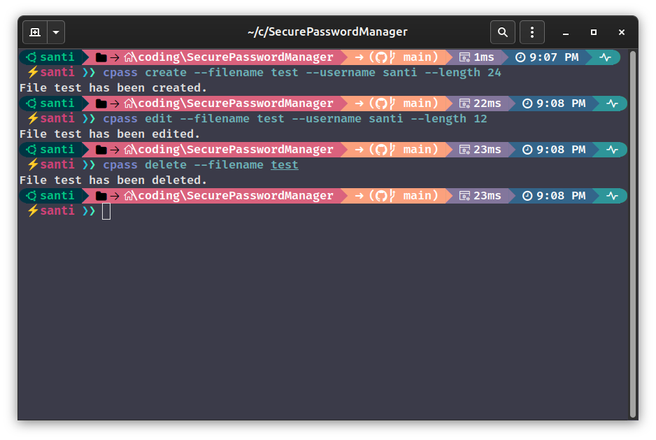

# Secure Password Manager
 With this program you will be able to create random passwords with the length you desire. The passwords will be saved in the same directory your console is.
 You can also edit the password generating another one or even delete a file you don't need anymore.

   
   

 ## Usage
First of all, you can install this project with `pip install sec-pass-manager`

### Console Interface
You can manage password files using the console command `cpass`. Here are examples of each function:

  

<pre><code>cpass create --filename test --username santi --length 24</code></pre>
<pre><code>cpass edit --filename test --username santi --length 12</code></pre>
<pre><code>cpass delete --filename test</code></pre>

There is also de reduced commands
<pre><code>cpass create -f test -u santi -l 24</code></pre>
<pre><code>cpass edit -f test -u santi -l 12</code></pre>
<pre><code>cpass delete -f test</code></pre>

> [!NOTE]
> This program will create `.key` files that you can open with any notepad as if it was a `.txt`  If you don't indicate a length it will be set to 10 as default.

